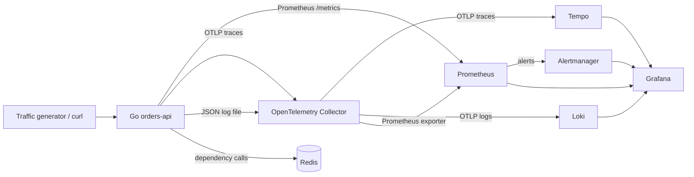
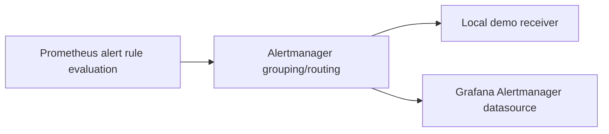
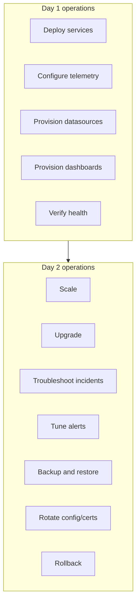

# Cloud-Native Observability Lab

A complete local observability demo designed for a **Junior Software Developer - Observability** technical review.

The lab demonstrates a realistic cloud-native telemetry flow:

> A Go service generates metrics, logs and traces. OpenTelemetry Collector receives and routes telemetry. Prometheus evaluates metrics and alert rules. Alertmanager receives alerts. Loki stores logs. Tempo stores traces. Grafana correlates everything. Kubernetes manifests and Juju-oriented docs explain how the same ideas map to operator-driven platform operations.

This is intentionally not an enterprise platform. It is a stable, reproducible, local technical demo you can run, inspect and explain.

---

## Repository structure

```text
observability-lab/
├── README.md
├── Makefile
├── docker-compose.yml
├── .env.example
├── app/                         # Go HTTP service
├── otel/                        # OpenTelemetry Collector config
├── prometheus/                  # scrape config and alert rules
├── alertmanager/                # local Alertmanager config
├── grafana/                     # provisioned datasources and dashboard
├── loki/                        # Loki config
├── promtail/                    # optional Promtail comparison pipeline
├── tempo/                       # Tempo config
├── mimir/                       # optional advanced Mimir profile
├── k8s/                         # kind/local Kubernetes manifests
├── juju/                        # Juju concept mapping + charm skeleton
├── snap/                        # conceptual Snap packaging example
├── docs/                        # architecture, technical review notes, Day 2 ops
├── scripts/                     # traffic, errors, k8s port-forward, cleanup
└── tests/                       # smoke test
```

---

## Architecture



ASCII version:

```text
curl/traffic
    |
    v
Go orders-api ---- /metrics ----------------------> Prometheus -----> Alertmanager
    |                                                   |
    | Redis dependency                                  |
    |                                                   v
    +---- OTLP traces ---> OpenTelemetry Collector ---> Tempo -------> Grafana
    +---- JSON logs  ----> OpenTelemetry Collector ---> Loki --------> Grafana
```

---

## Components

| Component | Engineering Context in this lab |
|---|---|
| Go app | emits metrics, logs and OpenTelemetry traces |
| Redis | lightweight stateful dependency used to simulate external latency/errors |
| OpenTelemetry Collector | receives, enriches, batches and routes telemetry |
| Prometheus | scrapes metrics, stores local TSDB, evaluates alert rules |
| Alertmanager | receives alerts and demonstrates alert routing/grouping |
| Loki | stores/query logs |
| Tempo | stores/query traces |
| Grafana | correlates metrics, logs, traces and alerts |
| Mimir | optional advanced scalable metrics backend discussion/profile |
| Kubernetes | local kind manifests for a cloud-native deployment mode |
| Juju docs | maps the lab to operator-driven models, charms and Day 2 operations |

---

## Prerequisites

For the quickstart:

- Linux or Windows + WSL Ubuntu;
- Docker Desktop running;
- GNU Make;
- curl.

Optional for development:

- Go 1.23+;
- kind;
- kubectl;
- snapcraft, only if exploring Snap packaging.

No Node/pnpm is required.

---

## Quickstart with Docker Compose

From the repository root:

```bash
make up
make traffic
make test
```

Open:

| UI | URL |
|---|---|
| App health | <http://localhost:8080/health> |
| App metrics | <http://localhost:8080/metrics> |
| Grafana | <http://localhost:3000> |
| Prometheus | <http://localhost:9090> |
| Alertmanager | <http://localhost:9093> |
| Loki | <http://localhost:3100> |
| Tempo | <http://localhost:3200> |

Grafana credentials:

```text
user: admin
password: admin
```

Anonymous admin access is also enabled for the local demo.

---

## Demo endpoints

| Endpoint | Purpose |
|---|---|
| `GET /health` | health check with Redis status |
| `GET /api/orders` | normal request with small random latency |
| `GET /api/slow` | slow dependency-like request using Redis |
| `GET /api/error` | occasional intentional error to trigger alerts |
| `GET /metrics` | Prometheus metrics endpoint |

Manual traffic:

```bash
curl http://localhost:8080/api/orders
curl http://localhost:8080/api/slow
curl http://localhost:8080/api/error
```

Automated traffic:

```bash
make traffic
```

Trigger alert-worthy errors:

```bash
make errors
```

---

## How to see metrics

1. Start the stack:

```bash
make up
```

2. Generate traffic:

```bash
make traffic
```

3. Open Prometheus:

<http://localhost:9090>

Useful PromQL examples:

```promql
sum(rate(demo_http_requests_total[1m])) by (route)

sum(rate(demo_http_requests_total{status=~"5.."}[1m])) by (route)

histogram_quantile(
  0.95,
  sum(rate(demo_http_request_duration_seconds_bucket[2m])) by (le, route)
)

histogram_quantile(
  0.95,
  sum(rate(demo_dependency_duration_seconds_bucket[2m])) by (le, operation)
)
```

---

## How to see logs

Logs are structured JSON. The app writes to stdout and to a shared file volume:

```text
/var/log/observability-lab/app.log
```

The OpenTelemetry Collector reads that file with the `filelog` receiver and sends logs to Loki using OTLP/HTTP.

In Grafana:

1. open <http://localhost:3000>;
2. go to the provisioned dashboard;
3. inspect the `Logs from Loki` panel.

Useful LogQL:

```logql
{service_name="orders-api"} | json
```

Optional Promtail comparison pipeline:

```bash
make promtail-up
```

Promtail is optional because the default path intentionally shows OpenTelemetry as a logs pipeline too.

---

## How to see traces

The Go app sends OTLP traces to the collector. The collector exports them to Tempo.

1. Generate traffic:

```bash
make traffic
```

2. Open Grafana → Explore → Tempo.

TraceQL example:

```traceql
{ resource.service.name = "orders-api" }
```

The app creates spans for:

- HTTP server handling;
- `/health` checks;
- `/api/orders`;
- `/api/slow`;
- intentional errors;
- Redis operations.

---

## How to see alerts

Generate errors:

```bash
make errors
```

Open:

- Prometheus alerts: <http://localhost:9090/alerts>
- Alertmanager: <http://localhost:9093>

Alert rules are in:

```text
prometheus/alert-rules.yml
```

Included demo alerts:

- `OrdersApiDown`
- `HighErrorRate`
- `HighP95Latency`
- `RedisDependencyErrors`

Alert pipeline:



---

## Docker Compose commands

```bash
make up          # build and start all core services
make down        # stop services
make logs        # follow logs
make traffic     # generate normal/slow/error traffic
make errors      # generate error-heavy traffic
make test        # run smoke checks
make clean       # remove containers and volumes
make mimir-up    # start optional Mimir profile
make promtail-up # start optional Promtail comparison path
```

---

## Advanced local Kubernetes mode

The Kubernetes mode uses kind and raw manifests. It is intentionally explicit so you can discuss Kubernetes primitives in technical review.

```bash
make k8s-up
make k8s-deploy
make k8s-forward
```

Then open the same local URLs:

- App: <http://localhost:8080/health>
- Grafana: <http://localhost:3000>
- Prometheus: <http://localhost:9090>
- Alertmanager: <http://localhost:9093>

Kubernetes files:

```text
k8s/namespace.yaml
k8s/app-deployment.yaml
k8s/app-service.yaml
k8s/redis.yaml
k8s/otel-collector.yaml
k8s/prometheus.yaml
k8s/alertmanager.yaml
k8s/loki.yaml
k8s/tempo.yaml
k8s/grafana.yaml
```

Clean up:

```bash
make k8s-clean
```

---

## Juju / charms / operator/platform mapping

This repository includes:

```text
juju/README.md
juju/charm-skeleton/
docs/juju-charms-operators.md
```

Conceptual model split:

```text
Juju model: workloads
  - orders-api
  - redis

Juju model: observability
  - grafana
  - prometheus / mimir
  - loki
  - tempo
  - alertmanager
  - telemetry collector / agent
```

---

## Day 1 / Day 2 mapping



See:

```text
docs/day1-day2-operations.md
```

---

## Cassandra/stateful service decision

The runnable demo uses Redis instead of Cassandra.

Reason: Cassandra is excellent for a stateful observability scenario, but it is heavier and easier to make fragile in a local technical review demo. Redis gives us a stable stateful dependency with observable latency, errors and traces.

Cassandra is documented as an advanced extension in:

```text
docs/cassandra-stateful.md
```

If Cassandra were added, I would observe:

- read/write latency;
- compaction;
- dropped messages;
- pending tasks;
- disk usage;
- heap/GC;
- node availability;
- client-side timeout/error rate.

---

## Mimir decision

Base mode uses Prometheus directly.

Why:

- simpler;
- stable locally;
- easier to inspect;
- sufficient for a single-node demo.

Mimir is included as optional advanced context because it is useful when you need:

- long-term metrics storage;
- horizontal scaling;
- multi-tenancy;
- Prometheus remote-write aggregation;
- high availability.

Run optional profile:

```bash
make mimir-up
```

See:

```text
mimir/README.md
```

---

## eBPF / Parca decision

Parca/eBPF is not enabled by default because it can require privileged host access and kernel support. This is especially fragile on WSL/Docker Desktop.

It is documented in:

```text
docs/parca-ebpf.md
```

---

## Snap decision

Snap is included as a conceptual packaging extension:

```text
snap/snapcraft.yaml
docs/snap-packaging.md
```

---

## OpenStack context

This lab does not deploy OpenStack locally. It documents where OpenStack fits architecturally:

```text
docs/openstack-context.md
```

---

## Troubleshooting

Main guide:

```text
docs/troubleshooting.md
```

Fast checks:

```bash
docker compose ps
docker compose logs -f --tail=200
curl http://localhost:8080/health
curl http://localhost:8080/metrics
open http://localhost:9090/targets
```

If ports are busy, edit `.env` after copying:

```bash
cp .env.example .env
```

---

## Why these components

- **Go**: small compiled service, readable instrumentation, relevant to cloud-native backend work.
- **Prometheus**: best fit for scraping, PromQL and alert rule evaluation in a local demo.
- **OpenTelemetry Collector**: decouples telemetry emission from backend-specific details.
- **Loki**: log aggregation that integrates well with Grafana and trace correlation.
- **Tempo**: simple trace backend for OpenTelemetry traces.
- **Alertmanager**: shows alert lifecycle after Prometheus rule evaluation.
- **Grafana**: practical correlation layer for metrics, logs, traces and alerts.
- **Redis instead of Cassandra**: keeps the demo reliable while still showing stateful dependency observability.
- **Mimir optional**: important for scale and tenancy, unnecessary for a base local lab.
- **Parca optional**: important conceptually, but local eBPF can be fragile.
- **Juju docs/charm skeleton**: demonstrates awareness of an operator-driven platform operations model.

---

## Clean up

```bash
make clean
```

For Kubernetes:

```bash
make k8s-clean
```
