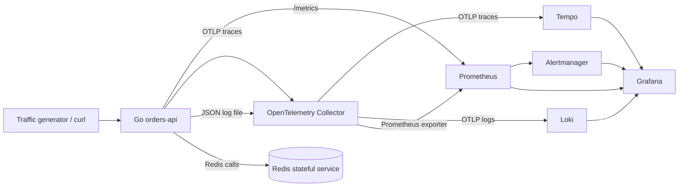

# Architecture

This lab models a small but complete observability platform:



ASCII equivalent:

```text
request -> Go app -> metrics (/metrics) -----------> Prometheus -----> Alertmanager
             |             ^                              |
             |             |                              v
             |       Redis dependency                  Grafana
             |
             +-> OTLP traces -> OpenTelemetry Collector -> Tempo -> Grafana
             +-> JSON logs  -> OpenTelemetry Collector -> Loki  -> Grafana
```

## Why this design?

The key idea is separation of responsibilities:

- The Go app emits telemetry close to the workload.
- OpenTelemetry Collector receives, enriches, batches and routes telemetry.
- Prometheus remains the local metrics database and PromQL query engine.
- Loki stores logs efficiently by indexing labels, not full log text.
- Tempo stores traces and enables trace exploration from Grafana.
- Alertmanager owns alert grouping, routing and inhibition.
- Grafana correlates metrics, logs, traces and alerts.

## What enters the OpenTelemetry Collector?

- OTLP traces from the Go app on port `4317`.
- Prometheus metrics scraped from the app by the collector receiver.
- Structured JSON logs read from the shared app log file by the `filelog` receiver.

## What leaves the Collector?

- Traces go to Tempo using OTLP/gRPC.
- Logs go to Loki using OTLP/HTTP.
- Metrics are re-exposed on a Prometheus exporter endpoint and scraped by Prometheus.

## OpenTelemetry does not replace Prometheus, Loki or Tempo

OpenTelemetry standardizes instrumentation and transport. It does not remove the need for storage/query backends:

- Prometheus stores/query metrics with PromQL and evaluates alert rules.
- Loki stores/query logs with LogQL.
- Tempo stores/query traces with TraceQL and trace IDs.
- The collector is a routing/processing layer, not the long-term analytical backend.

## Base vs advanced mode

Base mode uses Prometheus directly. This is correct for a local demo because it is easy to inspect and explain.

Advanced mode includes Mimir as a discussion point for horizontally scalable, multi-tenant metrics storage. In production Prometheus often becomes an edge scraper and remote-writes to Mimir.
